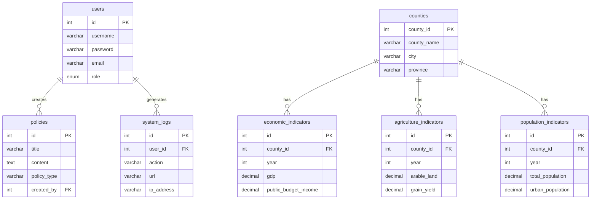

# 数据库设计文档

本文档详细描述了CI-PAE系统的数据库设计，包括表结构、关系图、数据字典和优化策略。

## 📋 目录

- [数据库概览](#数据库概览)
- [表结构设计](#表结构设计)
- [关系图](#关系图)
- [数据字典](#数据字典)
- [索引设计](#索引设计)
- [初始化脚本](#初始化脚本)
- [备份恢复](#备份恢复)
- [性能优化](#性能优化)

## 🗄️ 数据库概览

### 基本信息

- **数据库名称**: `ci_pae`
- **字符集**: `utf8mb4`
- **排序规则**: `utf8mb4_unicode_ci`
- **存储引擎**: `InnoDB`
- **MySQL版本**: 8.0+

### 设计原则

1. **规范化设计**: 遵循第三范式，减少数据冗余
2. **主键策略**: 使用自增整数作为主键
3. **外键约束**: 确保数据完整性
4. **索引优化**: 针对查询场景创建合理索引
5. **数据类型**: 选择合适的数据类型节省存储空间

### 命名规范

- **表名**: 小写字母，下划线分隔，复数形式
- **字段名**: 小写字母，下划线分隔
- **索引名**: `idx_表名_字段名`
- **外键名**: `fk_表名_字段名`

## 📊 表结构设计

### 1. 用户表 (users)

用户认证和基本信息管理。

```sql
CREATE TABLE users (
  id INT AUTO_INCREMENT PRIMARY KEY COMMENT '用户ID',
  username VARCHAR(50) NOT NULL UNIQUE COMMENT '用户名',
  password VARCHAR(255) NOT NULL COMMENT '密码（加密存储）',
  email VARCHAR(100) COMMENT '邮箱地址',
  role ENUM('admin', 'user', 'analyst') DEFAULT 'user' COMMENT '用户角色',
  status ENUM('active', 'inactive', 'banned') DEFAULT 'active' COMMENT '用户状态',
  last_login_at TIMESTAMP NULL COMMENT '最后登录时间',
  created_at TIMESTAMP DEFAULT CURRENT_TIMESTAMP COMMENT '创建时间',
  updated_at TIMESTAMP DEFAULT CURRENT_TIMESTAMP ON UPDATE CURRENT_TIMESTAMP COMMENT '更新时间',

  INDEX idx_username (username),
  INDEX idx_email (email),
  INDEX idx_status (status),
  INDEX idx_created_at (created_at)
) ENGINE=InnoDB DEFAULT CHARSET=utf8mb4 COLLATE=utf8mb4_unicode_ci COMMENT='用户表';
```

**字段说明：**

| 字段名 | 类型 | 约束 | 说明 |
|--------|------|------|------|
| id | INT | PRIMARY KEY | 用户唯一标识 |
| username | VARCHAR(50) | NOT NULL, UNIQUE | 用户名，唯一 |
| password | VARCHAR(255) | NOT NULL | 密码，加密存储 |
| email | VARCHAR(100) | NULL | 邮箱地址 |
| role | ENUM | DEFAULT 'user' | 用户角色：admin/user/analyst |
| status | ENUM | DEFAULT 'active' | 用户状态：active/inactive/banned |
| last_login_at | TIMESTAMP | NULL | 最后登录时间 |
| created_at | TIMESTAMP | DEFAULT CURRENT_TIMESTAMP | 创建时间 |
| updated_at | TIMESTAMP | DEFAULT CURRENT_TIMESTAMP ON UPDATE CURRENT_TIMESTAMP | 更新时间 |

### 2. 地理区域表 (counties)

存储内蒙古自治区的县区地理信息。

```sql
CREATE TABLE counties (
  county_id INT AUTO_INCREMENT PRIMARY KEY COMMENT '县区ID',
  county_name VARCHAR(100) NOT NULL COMMENT '县区名称',
  city VARCHAR(50) NOT NULL COMMENT '所属城市',
  province VARCHAR(50) NOT NULL DEFAULT '内蒙古自治区' COMMENT '省份',
  code VARCHAR(20) COMMENT '行政区划代码',
  level ENUM('province', 'city', 'county') NOT NULL COMMENT '行政级别',
  parent_id INT NULL COMMENT '上级区域ID',
  sort_order INT DEFAULT 0 COMMENT '排序序号',
  created_at TIMESTAMP DEFAULT CURRENT_TIMESTAMP COMMENT '创建时间',
  updated_at TIMESTAMP DEFAULT CURRENT_TIMESTAMP ON UPDATE CURRENT_TIMESTAMP COMMENT '更新时间',

  UNIQUE KEY uk_county_name_city (county_name, city),
  INDEX idx_city (city),
  INDEX idx_province (province),
  INDEX idx_parent_id (parent_id),
  INDEX idx_level (level),
  INDEX idx_sort_order (sort_order)
) ENGINE=InnoDB DEFAULT CHARSET=utf8mb4 COLLATE=utf8mb4_unicode_ci COMMENT='地理区域表';
```

### 3. 政策信息表 (policies)

存储扶贫政策相关信息。

```sql
CREATE TABLE policies (
  id INT AUTO_INCREMENT PRIMARY KEY COMMENT '政策ID',
  title VARCHAR(500) NOT NULL COMMENT '政策标题',
  content TEXT COMMENT '政策内容',
  policy_type VARCHAR(100) NOT NULL COMMENT '政策类型',
  target_area VARCHAR(100) COMMENT '适用地区',
  effective_date DATE COMMENT '生效日期',
  expiry_date DATE COMMENT '失效日期',
  publish_department VARCHAR(200) COMMENT '发布部门',
  status ENUM('draft', 'published', 'expired', 'repealed') DEFAULT 'published' COMMENT '政策状态',
  priority ENUM('high', 'medium', 'low') DEFAULT 'medium' COMMENT '优先级',
  tags JSON COMMENT '政策标签',
  created_by INT COMMENT '创建人ID',
  created_at TIMESTAMP DEFAULT CURRENT_TIMESTAMP COMMENT '创建时间',
  updated_at TIMESTAMP DEFAULT CURRENT_TIMESTAMP ON UPDATE CURRENT_TIMESTAMP COMMENT '更新时间',

  INDEX idx_policy_type (policy_type),
  INDEX idx_target_area (target_area),
  INDEX idx_effective_date (effective_date),
  INDEX idx_status (status),
  INDEX idx_priority (priority),
  INDEX idx_created_by (created_by),
  INDEX idx_created_at (created_at),

  FOREIGN KEY (created_by) REFERENCES users(id) ON DELETE SET NULL
) ENGINE=InnoDB DEFAULT CHARSET=utf8mb4 COLLATE=utf8mb4_unicode_ci COMMENT='政策信息表';
```

### 4. 经济指标表 (economic_indicators)

存储各县区的经济指标数据。

```sql
CREATE TABLE economic_indicators (
  id INT AUTO_INCREMENT PRIMARY KEY COMMENT '记录ID',
  county_id INT NOT NULL COMMENT '县区ID',
  year INT NOT NULL COMMENT '年份',
  gdp DECIMAL(12,2) COMMENT '地区生产总值（亿元）',
  gdp_growth_rate DECIMAL(5,2) COMMENT 'GDP增长率（%）',
  public_budget_income DECIMAL(12,2) COMMENT '一般公共预算收入（万元）',
  public_budget_expenditure DECIMAL(12,2) COMMENT '一般公共预算支出（万元）',
  fiscal_revenue DECIMAL(12,2) COMMENT '财政收入（万元）',
  fixed_asset_investment DECIMAL(12,2) COMMENT '固定资产投资（亿元）',
  retail_sales DECIMAL(12,2) COMMENT '社会消费品零售总额（亿元）',
  per_capita_gdp DECIMAL(10,2) COMMENT '人均GDP（元）',
  urban_per_capita_income DECIMAL(10,2) COMMENT '城镇居民人均可支配收入（元）',
  rural_per_capita_income DECIMAL(10,2) COMMENT '农村居民人均可支配收入（元）',
  created_at TIMESTAMP DEFAULT CURRENT_TIMESTAMP COMMENT '创建时间',
  updated_at TIMESTAMP DEFAULT CURRENT_TIMESTAMP ON UPDATE CURRENT_TIMESTAMP COMMENT '更新时间',

  UNIQUE KEY uk_county_year (county_id, year),
  INDEX idx_year (year),
  INDEX idx_gdp (gdp),
  INDEX idx_county_year (county_id, year),

  FOREIGN KEY (county_id) REFERENCES counties(county_id) ON DELETE CASCADE
) ENGINE=InnoDB DEFAULT CHARSET=utf8mb4 COLLATE=utf8mb4_unicode_ci COMMENT='经济指标表';
```

### 5. 农业指标表 (agriculture_indicators)

存储各县区的农业指标数据。

```sql
CREATE TABLE agriculture_indicators (
  id INT AUTO_INCREMENT PRIMARY KEY COMMENT '记录ID',
  county_id INT NOT NULL COMMENT '县区ID',
  year INT NOT NULL COMMENT '年份',
  arable_land DECIMAL(10,2) COMMENT '耕地面积（公顷）',
  grain_yield DECIMAL(12,2) COMMENT '粮食产量（吨）',
  oil_yield DECIMAL(12,2) COMMENT '油料产量（吨）',
  cotton_yield DECIMAL(12,2) COMMENT '棉花产量（吨）',
  vegetable_yield DECIMAL(12,2) COMMENT '蔬菜产量（吨）',
  fruit_yield DECIMAL(12,2) COMMENT '水果产量（吨）',
  livestock_output DECIMAL(12,2) COMMENT '畜牧业产值（万元）',
  agricultural_mechanization DECIMAL(5,2) COMMENT '农业机械化率（%）',
  irrigation_area DECIMAL(10,2) COMMENT '灌溉面积（公顷）',
  created_at TIMESTAMP DEFAULT CURRENT_TIMESTAMP COMMENT '创建时间',
  updated_at TIMESTAMP DEFAULT CURRENT_TIMESTAMP ON UPDATE CURRENT_TIMESTAMP COMMENT '更新时间',

  UNIQUE KEY uk_county_year (county_id, year),
  INDEX idx_year (year),
  INDEX idx_grain_yield (grain_yield),
  INDEX idx_county_year (county_id, year),

  FOREIGN KEY (county_id) REFERENCES counties(county_id) ON DELETE CASCADE
) ENGINE=InnoDB DEFAULT CHARSET=utf8mb4 COLLATE=utf8mb4_unicode_ci COMMENT='农业指标表';
```

### 6. 人口指标表 (population_indicators)

存储各县区的人口指标数据。

```sql
CREATE TABLE population_indicators (
  id INT AUTO_INCREMENT PRIMARY KEY COMMENT '记录ID',
  county_id INT NOT NULL COMMENT '县区ID',
  year INT NOT NULL COMMENT '年份',
  total_population DECIMAL(10,2) COMMENT '总人口（万人）',
  urban_population DECIMAL(10,2) COMMENT '城镇人口（万人）',
  rural_population DECIMAL(10,2) COMMENT '农村人口（万人）',
  birth_rate DECIMAL(5,2) COMMENT '出生率（‰）',
  death_rate DECIMAL(5,2) COMMENT '死亡率（‰）',
  natural_growth_rate DECIMAL(5,2) COMMENT '自然增长率（‰）',
  population_density DECIMAL(8,2) COMMENT '人口密度（人/平方公里）',
  land_area DECIMAL(10,2) COMMENT '行政区域土地面积（平方公里）',
  household_count DECIMAL(10,2) COMMENT '户数（万户）',
  created_at TIMESTAMP DEFAULT CURRENT_TIMESTAMP COMMENT '创建时间',
  updated_at TIMESTAMP DEFAULT CURRENT_TIMESTAMP ON UPDATE CURRENT_TIMESTAMP COMMENT '更新时间',

  UNIQUE KEY uk_county_year (county_id, year),
  INDEX idx_year (year),
  INDEX idx_total_population (total_population),
  INDEX idx_county_year (county_id, year),

  FOREIGN KEY (county_id) REFERENCES counties(county_id) ON DELETE CASCADE
) ENGINE=InnoDB DEFAULT CHARSET=utf8mb4 COLLATE=utf8mb4_unicode_ci COMMENT='人口指标表';
```

### 7. 系统日志表 (system_logs)

记录系统操作日志。

```sql
CREATE TABLE system_logs (
  id INT AUTO_INCREMENT PRIMARY KEY COMMENT '日志ID',
  user_id INT COMMENT '用户ID',
  action VARCHAR(100) NOT NULL COMMENT '操作动作',
  resource VARCHAR(200) COMMENT '操作资源',
  method VARCHAR(10) COMMENT 'HTTP方法',
  url VARCHAR(500) COMMENT '请求URL',
  ip_address VARCHAR(45) COMMENT 'IP地址',
  user_agent TEXT COMMENT '用户代理',
  request_data JSON COMMENT '请求数据',
  response_data JSON COMMENT '响应数据',
  status_code INT COMMENT 'HTTP状态码',
  execution_time INT COMMENT '执行时间（毫秒）',
  created_at TIMESTAMP DEFAULT CURRENT_TIMESTAMP COMMENT '创建时间',

  INDEX idx_user_id (user_id),
  INDEX idx_action (action),
  INDEX idx_ip_address (ip_address),
  INDEX idx_created_at (created_at),
  INDEX idx_status_code (status_code),

  FOREIGN KEY (user_id) REFERENCES users(id) ON DELETE SET NULL
) ENGINE=InnoDB DEFAULT CHARSET=utf8mb4 COLLATE=utf8mb4_unicode_ci COMMENT='系统日志表';
```

### 8. 数据字典表 (data_dictionary)

存储系统中使用的数据字典。

```sql
CREATE TABLE data_dictionary (
  id INT AUTO_INCREMENT PRIMARY KEY COMMENT '字典ID',
  category VARCHAR(50) NOT NULL COMMENT '字典分类',
  code VARCHAR(50) NOT NULL COMMENT '字典编码',
  label VARCHAR(200) NOT NULL COMMENT '字典标签',
  value VARCHAR(500) COMMENT '字典值',
  parent_code VARCHAR(50) COMMENT '父级编码',
  sort_order INT DEFAULT 0 COMMENT '排序序号',
  status ENUM('active', 'inactive') DEFAULT 'active' COMMENT '状态',
  remark TEXT COMMENT '备注',
  created_at TIMESTAMP DEFAULT CURRENT_TIMESTAMP COMMENT '创建时间',
  updated_at TIMESTAMP DEFAULT CURRENT_TIMESTAMP ON UPDATE CURRENT_TIMESTAMP COMMENT '更新时间',

  UNIQUE KEY uk_category_code (category, code),
  INDEX idx_category (category),
  INDEX idx_parent_code (parent_code),
  INDEX idx_sort_order (sort_order),
  INDEX idx_status (status)
) ENGINE=InnoDB DEFAULT CHARSET=utf8mb4 COLLATE=utf8mb4_unicode_ci COMMENT='数据字典表';
```

## 📈 数据库关系图



## 📚 数据字典

### 用户角色 (user_role)

| 编码 | 标签 | 说明 |
|------|------|------|
| admin | 管理员 | 系统管理员，拥有所有权限 |
| user | 普通用户 | 基础用户，可查看和查询数据 |
| analyst | 分析师 | 数据分析师，可进行深度分析 |

### 政策类型 (policy_type)

| 编码 | 标签 | 说明 |
|------|------|------|
| industrial | 产业扶贫 | 产业发展相关扶贫政策 |
| education | 教育扶贫 | 教育支持相关扶贫政策 |
| health | 健康扶贫 | 医疗健康相关扶贫政策 |
| employment | 就业扶贫 | 就业促进相关扶贫政策 |
| financial | 金融扶贫 | 金融支持相关扶贫政策 |
| social_security | 社会保障扶贫 | 社会保障相关扶贫政策 |

### 行政级别 (admin_level)

| 编码 | 标签 | 说明 |
|------|------|------|
| province | 省级 | 省级行政区划 |
| city | 市级 | 市级行政区划 |
| county | 县级 | 县级行政区划 |

## 🔍 索引设计

### 主要索引

```sql
-- 用户表索引
CREATE INDEX idx_users_username ON users(username);
CREATE INDEX idx_users_email ON users(email);
CREATE INDEX idx_users_status ON users(status);
CREATE INDEX idx_users_created_at ON users(created_at);

-- 地理区域表索引
CREATE INDEX idx_counties_city ON counties(city);
CREATE INDEX idx_counties_province ON counties(province);
CREATE INDEX idx_counties_parent_id ON counties(parent_id);

-- 政策表索引
CREATE INDEX idx_policies_type ON policies(policy_type);
CREATE INDEX idx_policies_target_area ON policies(target_area);
CREATE INDEX idx_policies_effective_date ON policies(effective_date);
CREATE INDEX idx_policies_status ON policies(status);

-- 指标表联合索引
CREATE INDEX idx_economic_county_year ON economic_indicators(county_id, year);
CREATE INDEX idx_agriculture_county_year ON agriculture_indicators(county_id, year);
CREATE INDEX idx_population_county_year ON population_indicators(county_id, year);

-- 日志表索引
CREATE INDEX idx_system_logs_user_id ON system_logs(user_id);
CREATE INDEX idx_system_logs_action ON system_logs(action);
CREATE INDEX idx_system_logs_created_at ON system_logs(created_at);
```

### 复合索引策略

```sql
-- 查询优化索引
CREATE INDEX idx_policies_type_status ON policies(policy_type, status);
CREATE INDEX idx_policies_area_effective ON policies(target_area, effective_date);

-- 时间范围查询索引
CREATE INDEX idx_economic_year_gdp ON economic_indicators(year, gdp);
CREATE INDEX idx_population_year_total ON population_indicators(year, total_population);
```

## 📜 初始化脚本

### 数据库创建脚本

```sql
-- database/init.sql
-- 创建数据库
CREATE DATABASE IF NOT EXISTS ci_pae
CHARACTER SET utf8mb4
COLLATE utf8mb4_unicode_ci;

USE ci_pae;

-- 创建所有表（包含上面的CREATE TABLE语句）

-- 插入基础数据
INSERT INTO counties (county_name, city, province, level) VALUES
('新城区', '呼和浩特市', '内蒙古自治区', 'county'),
('回民区', '呼和浩特市', '内蒙古自治区', 'county'),
('玉泉区', '呼和浩特市', '内蒙古自治区', 'county'),
('赛罕区', '呼和浩特市', '内蒙古自治区', 'county'),
('土默特左旗', '呼和浩特市', '内蒙古自治区', 'county'),
('托克托县', '呼和浩特市', '内蒙古自治区', 'county'),
('和林格尔县', '呼和浩特市', '内蒙古自治区', 'county'),
('清水河县', '呼和浩特市', '内蒙古自治区', 'county'),
('武川县', '呼和浩特市', '内蒙古自治区', 'county');

-- 插入数据字典
INSERT INTO data_dictionary (category, code, label, value) VALUES
('user_role', 'admin', '管理员', '系统管理员'),
('user_role', 'user', '普通用户', '基础用户'),
('user_role', 'analyst', '分析师', '数据分析师'),
('policy_type', 'industrial', '产业扶贫', '产业发展相关'),
('policy_type', 'education', '教育扶贫', '教育支持相关'),
('policy_type', 'health', '健康扶贫', '医疗健康相关');

-- 创建默认管理员用户
INSERT INTO users (username, password, role, status) VALUES
('admin', 'admin123', 'admin', 'active');
```

### 测试数据脚本

```sql
-- database/test_data.sql
USE ci_pae;

-- 插入测试数据
INSERT INTO economic_indicators (county_id, year, gdp, public_budget_income) VALUES
(1, 2020, 150.50, 85000),
(1, 2021, 165.80, 92000),
(1, 2022, 178.90, 101000),
(2, 2020, 120.30, 72000),
(2, 2021, 128.60, 78000),
(2, 2022, 135.40, 85000);

INSERT INTO agriculture_indicators (county_id, year, arable_land, grain_yield) VALUES
(1, 2020, 12500.50, 85000),
(1, 2021, 12300.80, 88000),
(1, 2022, 12000.90, 92000),
(2, 2020, 9800.30, 65000),
(2, 2021, 9600.60, 68000),
(2, 2022, 9400.40, 71000);
```

## 💾 备份恢复

### 备份策略

```bash
#!/bin/bash
# backup.sh

# 配置
DB_NAME="ci_pae"
DB_USER="root"
DB_PASSWORD="your_password"
BACKUP_DIR="/backup/mysql"
DATE=$(date +%Y%m%d_%H%M%S)

# 创建备份目录
mkdir -p $BACKUP_DIR

# 全量备份
mysqldump -u $DB_USER -p$DB_PASSWORD \
  --single-transaction \
  --routines \
  --triggers \
  --all-databases > $BACKUP_DIR/full_backup_$DATE.sql

# 压缩备份文件
gzip $BACKUP_DIR/full_backup_$DATE.sql

# 删除7天前的备份
find $BACKUP_DIR -name "full_backup_*.sql.gz" -mtime +7 -delete

echo "Backup completed: $BACKUP_DIR/full_backup_$DATE.sql.gz"
```

### 恢复操作

```bash
#!/bin/bash
# restore.sh

BACKUP_FILE=$1
DB_USER="root"
DB_PASSWORD="your_password"

if [ -z "$BACKUP_FILE" ]; then
  echo "Usage: $0 <backup_file>"
  exit 1
fi

# 解压备份文件（如果需要）
if [[ $BACKUP_FILE == *.gz ]]; then
  gunzip -c $BACKUP_FILE | mysql -u $DB_USER -p$DB_PASSWORD
else
  mysql -u $DB_USER -p$DB_PASSWORD < $BACKUP_FILE
fi

echo "Database restored from: $BACKUP_FILE"
```

### 定期备份（Crontab）

```bash
# 每天凌晨2点执行备份
0 2 * * * /path/to/backup.sh

# 每周日凌晨3点执行完整备份
0 3 * * 0 /path/to/full_backup.sh
```

## ⚡ 性能优化

### 查询优化

```sql
-- 避免SELECT *
SELECT id, county_name, city FROM counties WHERE province = '内蒙古自治区';

-- 使用LIMIT分页
SELECT * FROM policies ORDER BY created_at DESC LIMIT 10 OFFSET 20;

-- 使用索引优化查询
EXPLAIN SELECT * FROM economic_indicators
WHERE county_id = 1 AND year BETWEEN 2020 AND 2023;

-- 合理使用JOIN
SELECT c.county_name, e.gdp, e.year
FROM counties c
INNER JOIN economic_indicators e ON c.county_id = e.county_id
WHERE c.city = '呼和浩特市';
```

### 配置优化

```sql
-- MySQL配置优化
SET GLOBAL innodb_buffer_pool_size = 1G;
SET GLOBAL innodb_log_file_size = 256M;
SET GLOBAL innodb_flush_log_at_trx_commit = 2;
SET GLOBAL sync_binlog = 0;
SET GLOBAL innodb_flush_method = O_DIRECT;

-- 查询缓存（MySQL 8.0已移除，可使用Redis等替代）
```

### 监控指标

```sql
-- 查看慢查询
SHOW VARIABLES LIKE 'slow_query_log';
SHOW VARIABLES LIKE 'long_query_time';

-- 查看表状态
SHOW TABLE STATUS FROM ci_pae;

-- 查看索引使用情况
SHOW INDEX FROM economic_indicators;

-- 分析表
ANALYZE TABLE economic_indicators;
```

## 🔧 维护建议

### 定期维护

1. **每周任务**
   - 检查慢查询日志
   - 监控数据库性能
   - 验证备份完整性

2. **每月任务**
   - 更新统计信息
   - 优化表结构
   - 清理过期日志

3. **每季度任务**
   - 审查索引使用情况
   - 调整数据库配置
   - 容量规划评估

### 监控告警

```sql
-- 监控连接数
SHOW STATUS LIKE 'Threads_connected';
SHOW VARIABLES LIKE 'max_connections';

-- 监控缓存命中率
SHOW STATUS LIKE 'Innodb_buffer_pool_read%';

-- 监控锁等待
SHOW STATUS LIKE 'Innodb_row_lock%';
```

---

**文档版本**: v1.0.0
**最后更新**: 2024年1月XX日
**维护者**: CI-PAE开发团队