# 开发指南

本文档为CI-PAE项目开发者提供详细的开发指南，包括环境搭建、代码规范、贡献流程等。

## 📋 目录

- [开发环境搭建](#开发环境搭建)
- [项目结构说明](#项目结构说明)
- [代码规范](#代码规范)
- [Git工作流](#git工作流)
- [开发流程](#开发流程)
- [测试指南](#测试指南)
- [调试技巧](#调试技巧)
- [常见问题](#常见问题)

## 🛠️ 开发环境搭建

### 1. 基础环境要求

- **Node.js**: >= 18.0.0
- **npm**: >= 8.0.0 或 **yarn**: >= 1.22.0
- **MySQL**: >= 8.0.0
- **Git**: >= 2.0.0
- **VS Code**: (推荐) 或其他代码编辑器

### 2. 开发工具安装

#### Node.js 安装

```bash
# 使用nvm安装Node.js
curl -o- https://raw.githubusercontent.com/nvm-sh/nvm/v0.39.0/install.sh | bash
source ~/.bashrc
nvm install 18
nvm use 18
```

#### MySQL 安装

```bash
# Ubuntu/Debian
sudo apt update
sudo apt install mysql-server mysql-client

# macOS
brew install mysql

# Windows
# 下载MySQL官方安装包
```

#### 开发工具推荐

**VS Code扩展：**
- Vue Language Features (Volar)
- Prettier - Code formatter
- ESLint
- GitLens
- Thunder Client (API测试)
- MySQL

### 3. 项目搭建

```bash
# 1. 克隆项目
git clone https://github.com/your-username/CI_PAE.git
cd CI_PAE

# 2. 安装后端依赖
cd backend
npm install

# 3. 安装前端依赖
cd ../frontend
npm install

# 4. 配置环境变量
cp .env.example .env
# 编辑 .env 文件，配置数据库连接

# 5. 初始化数据库
cd backend
npm run init-db

# 6. 启动开发服务
npm run dev  # 后端服务
cd ../frontend
npm run dev  # 前端服务（新终端）
```

### 4. IDE配置

#### VS Code配置

创建 `.vscode/settings.json`:

```json
{
  "editor.formatOnSave": true,
  "editor.codeActionsOnSave": {
    "source.fixAll.eslint": true
  },
  "eslint.validate": [
    "javascript",
    "vue"
  ],
  "editor.tabSize": 2,
  "editor.insertSpaces": true,
  "vetur.validation.template": false,
  "volar.codeLens.enabled": true,
  "vue.codeActions.enabled": true
}
```

创建 `.vscode/launch.json`:

```json
{
  "version": "0.2.0",
  "configurations": [
    {
      "name": "Debug Backend",
      "type": "node",
      "request": "launch",
      "program": "${workspaceFolder}/backend/server.js",
      "console": "integratedTerminal",
      "restart": true,
      "runtimeExecutable": "nodemon"
    }
  ]
}
```

## 📁 项目结构说明

```
CI_PAE/
├── backend/                    # 后端应用
│   ├── app.js                 # Express应用配置
│   ├── server.js              # 服务启动入口
│   ├── config/                # 配置文件
│   │   ├── db.js              # 数据库配置
│   │   └── index.js           # 应用配置
│   ├── controllers/           # 控制器层
│   │   ├── analysisController.js
│   │   ├── authController.js
│   │   └── ...
│   ├── middleware/            # 中间件
│   │   ├── auth.js
│   │   └── errorHandler.js
│   ├── routes/                # 路由定义
│   │   ├── index.js
│   │   ├── analysis.js
│   │   └── ...
│   ├── services/              # 业务逻辑层
│   │   ├── authService.js
│   │   └── analysisService.js
│   ├── database/              # 数据库相关
│   │   ├── initDb.js          # 数据库初始化
│   │   └── migrations/        # 数据库迁移
│   └── package.json
├── frontend/                   # 前端应用
│   ├── public/                # 静态资源
│   ├── src/
│   │   ├── api/               # API调用
│   │   │   ├── index.js       # 主要API
│   │   │   ├── account.js     # 认证API
│   │   │   └── analysis.js    # 分析API
│   │   ├── components/        # 通用组件
│   │   │   └── Layout/        # 布局组件
│   │   ├── router/            # 路由配置
│   │   │   └── index.js
│   │   ├── utils/             # 工具函数
│   │   ├── views/             # 页面组件
│   │   │   ├── Login.vue
│   │   │   ├── Dashboard.vue
│   │   │   └── ...
│   │   ├── main.js            # 应用入口
│   │   └── App.vue            # 根组件
│   ├── vite.config.js         # Vite配置
│   └── package.json
├── docs/                      # 项目文档
├── scripts/                   # 脚本文件
└── tests/                     # 测试文件
```

## 📝 代码规范

### JavaScript/TypeScript规范

#### 命名规范

```javascript
// 变量和函数：驼峰命名
const userName = 'admin';
const getUserInfo = () => {};

// 常量：大写下划线
const API_BASE_URL = 'http://localhost:3001';
const MAX_RETRY_COUNT = 3;

// 类名：大驼峰
class UserService {}
class DatabaseManager {}

// 文件名：小驼峰或短横线
// userService.js 或 user-service.js
```

#### 代码风格

```javascript
// 使用const/let，避免使用var
const apiUrl = 'https://api.example.com';
let retryCount = 0;

// 使用箭头函数（回调函数推荐）
const users = data.map(item => ({
  id: item.id,
  name: item.name
}));

// 使用解构赋值
const { id, name, email } = user;
const [first, second] = array;

// 使用模板字符串
const message = `Hello ${name}, you have ${count} new messages.`;

// 使用async/await替代Promise链
async function fetchUserData(userId) {
  try {
    const response = await api.get(`/users/${userId}`);
    return response.data;
  } catch (error) {
    console.error('Failed to fetch user:', error);
    throw error;
  }
}
```

#### 错误处理

```javascript
// 统一错误处理
class ApiError extends Error {
  constructor(message, code = 500) {
    super(message);
    this.code = code;
    this.name = 'ApiError';
  }
}

// 使用try-catch包裹异步操作
async function handleRequest(req, res) {
  try {
    const result = await processData(req.body);
    res.json({ ok: true, data: result });
  } catch (error) {
    console.error('Request failed:', error);
    res.status(error.code || 500).json({
      ok: false,
      error: error.message
    });
  }
}
```

### Vue.js规范

#### 组件命名

```vue
<!-- 组件文件名：大驼峰 -->
<!-- UserProfile.vue -->
<template>
  <div class="user-profile">
    <!-- 内容 -->
  </div>
</template>

<script>
export default {
  name: 'UserProfile', // 组件名：大驼峰
  // ...
}
</script>
```

#### 组件结构

```vue
<template>
  <!-- 模板内容 -->
</template>

<script>
import { ref, computed, onMounted } from 'vue';
import { useRouter } from 'vue-router';

export default {
  name: 'ComponentName',
  components: {
    // 子组件
  },
  props: {
    // 组件属性
  },
  setup(props, { emit }) {
    // 响应式数据
    const count = ref(0);
    const loading = ref(false);

    // 计算属性
    const doubleCount = computed(() => count.value * 2);

    // 路由
    const router = useRouter();

    // 生命周期
    onMounted(() => {
      // 组件挂载后执行
    });

    // 方法
    const increment = () => {
      count.value++;
      emit('update:count', count.value);
    };

    return {
      count,
      doubleCount,
      loading,
      increment
    };
  }
}
</script>

<style scoped>
/* 组件样式 */
</style>
```

#### API调用规范

```javascript
// src/api/example.js
import axios from 'axios';

const instance = axios.create({
  baseURL: import.meta.env.VITE_API_URL,
  timeout: 10000
});

// 请求拦截器
instance.interceptors.request.use(
  config => {
    const token = localStorage.getItem('token');
    if (token) {
      config.headers.Authorization = `Bearer ${token}`;
    }
    return config;
  }
);

// 响应拦截器
instance.interceptors.response.use(
  response => response,
  error => {
    if (error.response?.status === 401) {
      localStorage.removeItem('token');
      window.location.href = '/login';
    }
    return Promise.reject(error);
  }
);

export const getUserList = async (params = {}) => {
  try {
    const response = await instance.get('/users', { params });
    return response.data;
  } catch (error) {
    console.error('Failed to get user list:', error);
    throw error.response?.data || { ok: false, error: 'Request failed' };
  }
};
```

### CSS规范

```css
/* 使用BEM命名规范 */
.user-card {
  border: 1px solid #e0e0e0;
  border-radius: 4px;
}

.user-card__header {
  padding: 16px;
  border-bottom: 1px solid #e0e0e0;
}

.user-card__title {
  font-size: 16px;
  font-weight: 600;
  margin: 0;
}

.user-card--highlighted {
  border-color: #1890ff;
  box-shadow: 0 2px 8px rgba(24, 144, 255, 0.2);
}

/* 使用CSS变量 */
:root {
  --primary-color: #1890ff;
  --success-color: #52c41a;
  --warning-color: #faad14;
  --error-color: #f5222d;
  --text-color: #262626;
  --border-color: #e0e0e0;
}
```

## 🌿 Git工作流

### 分支策略

```
main                 # 主分支，生产环境代码
├── develop          # 开发分支，集成最新功能
├── feature/*        # 功能分支
├── hotfix/*         # 热修复分支
└── release/*        # 发布分支
```

### 提交规范

#### 提交消息格式

```
<type>(<scope>): <description>

[optional body]

[optional footer]
```

#### Type 类型

- `feat`: 新功能
- `fix`: 修复bug
- `docs`: 文档更新
- `style`: 代码格式化（不影响功能）
- `refactor`: 重构代码
- `test`: 测试相关
- `chore`: 构建过程或辅助工具的变动

#### 示例

```bash
git commit -m "feat(analysis): add data export functionality"

git commit -m "fix(auth): resolve token expiration issue"

git commit -m "docs(readme): update installation guide"
```

### 工作流程

1. **创建功能分支**
```bash
git checkout develop
git pull origin develop
git checkout -b feature/user-profile
```

2. **开发功能**
```bash
# 编写代码...
git add .
git commit -m "feat(user): add user profile page"
```

3. **推送分支**
```bash
git push origin feature/user-profile
```

4. **创建Pull Request**
- 从 `feature/user-profile` 向 `develop` 创建PR
- 代码审查通过后合并

5. **部署和发布**
```bash
git checkout develop
git pull origin develop
git checkout main
git merge develop
git tag v1.1.0
git push origin main --tags
```

## 🔄 开发流程

### 1. 功能开发流程

```mermaid
graph LR
    A[需求分析] --> B[设计评审]
    B --> C[开发实现]
    C --> D[代码审查]
    D --> E[测试验证]
    E --> F[部署发布]
```



### 2. 开发步骤

#### 第一步：需求分析
- 明确功能需求
- 设计API接口
- 评估工作量

#### 第二步：环境准备
```bash
# 创建功能分支
git checkout -b feature/new-feature

# 安装新依赖（如需要）
npm install new-package

# 创建开发配置
cp .env.example .env.local
```

#### 第三步：后端开发

**1. 数据库设计**
```sql
-- 创建新表
CREATE TABLE user_profiles (
  id INT AUTO_INCREMENT PRIMARY KEY,
  user_id INT NOT NULL,
  avatar VARCHAR(255),
  bio TEXT,
  created_at TIMESTAMP DEFAULT CURRENT_TIMESTAMP,
  FOREIGN KEY (user_id) REFERENCES users(id)
);
```

**2. 后端API开发**
```javascript
// controllers/userController.js
exports.getProfile = async (req, res) => {
  try {
    const { userId } = req.params;
    const profile = await userService.getProfile(userId);
    res.json({ ok: true, data: profile });
  } catch (error) {
    res.status(500).json({ ok: false, error: error.message });
  }
};
```

**3. 路由配置**
```javascript
// routes/user.js
router.get('/:userId/profile', userController.getProfile);
```

#### 第四步：前端开发

**1. API调用**
```javascript
// src/api/user.js
export const getUserProfile = async (userId) => {
  try {
    const response = await api.get(`/users/${userId}/profile`);
    return response.data;
  } catch (error) {
    throw error.response?.data || { ok: false, error: 'Failed to get profile' };
  }
};
```

**2. 组件开发**
```vue
<!-- src/views/UserProfile.vue -->
<template>
  <div class="user-profile">
    <a-spin :spinning="loading">
      <div class="profile-header">
        <a-avatar :size="64" :src="profile.avatar" />
        <h2>{{ profile.name }}</h2>
        <p>{{ profile.bio }}</p>
      </div>
    </a-spin>
  </div>
</template>

<script>
import { ref, onMounted } from 'vue';
import { useRoute } from 'vue-router';
import { getUserProfile } from '@/api/user';

export default {
  name: 'UserProfile',
  setup() {
    const route = useRoute();
    const profile = ref({});
    const loading = ref(false);

    const loadProfile = async () => {
      loading.value = true;
      try {
        const { userId } = route.params;
        const response = await getUserProfile(userId);
        if (response.ok) {
          profile.value = response.data;
        }
      } catch (error) {
        console.error('Failed to load profile:', error);
      } finally {
        loading.value = false;
      }
    };

    onMounted(loadProfile);

    return {
      profile,
      loading
    };
  }
};
</script>
```

#### 第五步：测试

```javascript
// tests/api/user.test.js
import { getUserProfile } from '@/api/user';

describe('User API', () => {
  test('should get user profile', async () => {
    const response = await getUserProfile(1);
    expect(response.ok).toBe(true);
    expect(response.data).toHaveProperty('id');
  });
});
```

### 3. 代码审查清单

#### 后端审查要点
- [ ] API接口设计合理
- [ ] 错误处理完善
- [ ] 输入验证完整
- [ ] 数据库查询优化
- [ ] 安全性检查（SQL注入、XSS等）
- [ ] 代码注释清晰

#### 前端审查要点
- [ ] 组件结构合理
- [ ] 状态管理正确
- [ ] 用户交互友好
- [ ] 响应式适配
- [ ] 性能优化
- [ ] 错误边界处理

## 🧪 测试指南

### 1. 测试类型

#### 单元测试
```javascript
// backend/tests/services/authService.test.js
const authService = require('../../services/authService');

describe('AuthService', () => {
  test('should login successfully with valid credentials', async () => {
    const result = await authService.login('testuser', 'testpass');
    expect(result).toHaveProperty('token');
    expect(result).toHaveProperty('user');
  });

  test('should throw error with invalid credentials', async () => {
    await expect(authService.login('invalid', 'credentials'))
      .rejects.toThrow('Invalid username or password');
  });
});
```

#### 集成测试
```javascript
// frontend/tests/integration/auth.test.js
import { mount } from '@vue/test-utils';
import { createRouter, createWebHistory } from 'vue-router';
import Login from '@/views/Login.vue';

describe('Login Integration', () => {
  test('should login successfully', async () => {
    const router = createRouter({
      history: createWebHistory(),
      routes: [{ path: '/', component: { template: '<div>Home</div>' } }]
    });

    const wrapper = mount(Login, {
      global: {
        plugins: [router]
      }
    });

    await wrapper.find('[data-testid="username"]').setValue('testuser');
    await wrapper.find('[data-testid="password"]').setValue('testpass');
    await wrapper.find('[data-testid="login-button"]').trigger('click');

    // 验证登录成功后的行为
  });
});
```

#### E2E测试
```javascript
// tests/e2e/login.spec.js
import { test, expect } from '@playwright/test';

test('user can login', async ({ page }) => {
  await page.goto('/login');

  await page.fill('[data-testid="username"]', 'testuser');
  await page.fill('[data-testid="password"]', 'testpass');
  await page.click('[data-testid="login-button"]');

  await expect(page).toHaveURL('/');
  await expect(page.locator('.user-menu')).toBeVisible();
});
```

### 2. 运行测试

```bash
# 运行所有测试
npm test

# 运行特定测试文件
npm test -- authService.test.js

# 运行测试并生成覆盖率报告
npm run test:coverage

# 监听模式运行测试
npm run test:watch

# 运行E2E测试
npm run test:e2e
```

## 🐛 调试技巧

### 1. 后端调试

#### VS Code调试配置
```json
{
  "type": "node",
  "request": "launch",
  "name": "Debug Backend",
  "program": "${workspaceFolder}/backend/server.js",
  "console": "integratedTerminal",
  "restart": true,
  "runtimeExecutable": "nodemon",
  "env": {
    "NODE_ENV": "development"
  }
}
```

#### 日志调试
```javascript
// 使用debug库
const debug = require('debug')('app:auth');

exports.login = async (username, password) => {
  debug('Attempting login for user: %s', username);

  try {
    const result = await authenticateUser(username, password);
    debug('Login successful for user: %s', username);
    return result;
  } catch (error) {
    debug('Login failed for user: %s, error: %o', username, error);
    throw error;
  }
};
```

### 2. 前端调试

#### Vue DevTools
- 安装Vue DevTools浏览器扩展
- 检查组件状态和响应式数据
- 追踪事件触发

#### 网络调试
```javascript
// API请求拦截器
instance.interceptors.request.use(
  config => {
    console.log('API Request:', {
      method: config.method,
      url: config.url,
      data: config.data
    });
    return config;
  }
);
```

#### 性能调试
```javascript
// 使用performance API测量性能
const startTime = performance.now();
await someAsyncOperation();
const endTime = performance.now();
console.log(`Operation took ${endTime - startTime} milliseconds`);
```

## ❓ 常见问题

### 1. 环境问题

#### Node.js版本不兼容
```bash
# 解决方案：使用nvm管理Node版本
nvm install 18
nvm use 18
nvm alias default 18
```

#### 数据库连接失败
```bash
# 检查MySQL服务状态
sudo systemctl status mysql

# 检查数据库配置
mysql -u root -p -e "SHOW DATABASES;"
```

#### 端口占用
```bash
# 查找占用端口的进程
lsof -i :3001
lsof -i :5174

# 杀死进程
kill -9 <PID>
```

### 2. 开发问题

#### 热重载不工作
```bash
# 检查文件监听限制
echo fs.inotify.max_user_watches=524288 | sudo tee -a /etc/sysctl.conf
sudo sysctl -p
```

#### 依赖安装失败
```bash
# 清除缓存重新安装
rm -rf node_modules package-lock.json
npm cache clean --force
npm install
```

#### 构建失败
```bash
# 检查Node.js内存限制
export NODE_OPTIONS="--max-old-space-size=4096"

# 或者增加swap空间
sudo fallocate -l 2G /swapfile
sudo chmod 600 /swapfile
sudo mkswap /swapfile
sudo swapon /swapfile
```

### 3. 代码问题

#### CORS错误
```javascript
// 检查后端CORS配置
const corsOptions = {
  origin: ['http://localhost:5174', 'http://your-domain.com'],
  credentials: true
};
```

#### API请求失败
```javascript
// 检查请求拦截器配置
// 检查网络请求地址
// 检查请求头设置
```

#### 组件渲染问题
```javascript
// 检查数据是否正确加载
// 检查响应式数据定义
// 检查生命周期钩子
```

## 📞 获取帮助

- **项目文档**: [项目Wiki](https://github.com/lowl6/CI_PAE/wiki)
- **问题反馈**: [GitHub Issues](https://github.com/lowl6/CI_PAE/issues)
- **团队沟通**: [Slack/Discord频道](https://your-team-channel.com)
- **技术支持**: dev-support@ci-pae.com

---

**最后更新**: 2024年1月XX日
**维护者**: CI-PAE开发团队